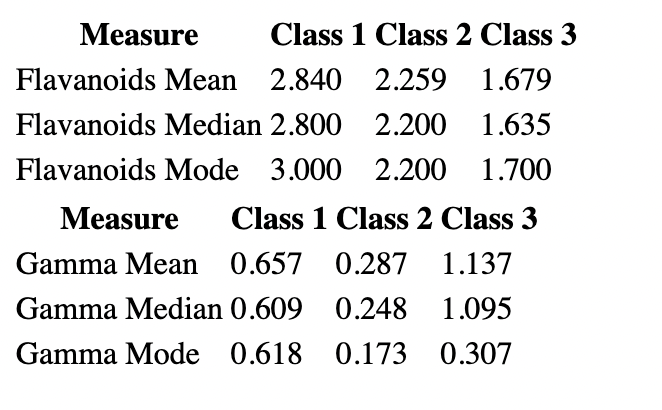

# Wine Stats App

This React application calculates statistical measures for the Wine Data Set, such as mean, median, and mode, and displays the results in a tabular format.

## Installation

1. Clone the repository.
2. Run `yarn install` to install dependencies.
3. Run `yarn start` to start the application.

## Usage

Upon running `yarn start`, the browser will open with the desired page rendered. The statistical measures are displayed in a tabular format.

## Screenshot

